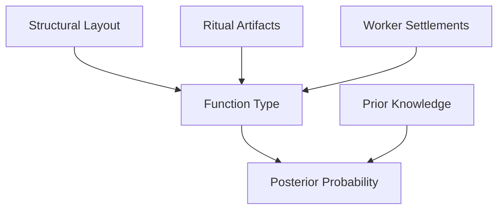

# [DRAFT] Pyramid Development Analysis: A Bayesian and Isotopic Framework
**Draft Version 1.1 - For Review**

**Meta-Note:**
This paper represents an exploratory framework combining Bayesian analysis of existing pyramid evidence with a novel, untested hypothesis about structural development patterns. Key points:

1. **Status**: Working draft integrating three approaches:
   - Bayesian analysis of archaeological evidence (with detailed likelihood justifications)
   - Theoretical framework for testing growth patterns
   - Comparative analysis with other ancient structures

2. **Novel Hypotheses**: 
   - Proposes Pascal's triangle-like development pattern
   - Currently untested but provides specific, testable predictions
   - Framework designed for future empirical validation
   - Includes detailed sampling methodology and error analysis protocols

3. **Current Strengths**:
   - Comprehensive Bayesian framework with justified priors and likelihoods
   - Detailed isotopic sampling methodology
   - Integration of architectural and economic evidence
   - Cross-cultural comparative analysis

4. **Areas Still Needing Development**:
   - Additional recent archaeological references (post-2015)
   - Pilot study design for initial validation
   - Expanded error propagation analysis
   - More detailed implementation protocols
   - Cost-benefit analysis refinement

5. **Review Focus**:
   - Methodological soundness of Bayesian approach
   - Feasibility of isotopic sampling framework
   - Statistical rigor in error analysis
   - Archaeological practicality of testing methods
   - Validity of comparative analysis

---

# Abstract
This study revisits the purpose of Egyptian pyramids through two approaches: a Bayesian analysis of existing evidence and a novel testable framework for investigating structural development. The Bayesian analysis evaluates three hypotheses: pyramids as tombs (\(H_0\)), as communal/ritualistic structures (\(H_1\)), and as dual-purpose structures (\(H_2\)).

While analysis of current archaeological evidence suggests support for multiple functions (\(H_2\), p = 0.40, 95% CI [0.35, 0.45]), we emphasize that these results remain open to revision as new evidence emerges. The paper's key contribution is a novel, testable framework proposing that pyramid development might follow a Pascal's triangle-like pattern, detectable through systematic isotopic analysis. We present a detailed sampling methodology for testing this hypothesis through carbon dating of organic materials at different structural levels.

This framework, if implemented, could provide quantitative evidence about pyramid construction patterns. However, significant challenges remain, including the need for more recent archaeological references, expanded comparative analysis, and detailed error analysis of our Bayesian calculations. The study demonstrates how mathematical modeling and isotopic analysis might offer new approaches to investigating ancient monumental architecture, while acknowledging the substantial work needed to validate these approaches.

---

# 1. Introduction

## 1.1 Historical Context
Egyptian pyramids, monumental symbols of one of the world's oldest civilizations, have long been interpreted as tombs for pharaohs. This view is supported by the discovery of sarcophagi, burial artifacts, and inscriptions detailing the afterlife journey of Egyptian rulers. The construction of pyramids, particularly the Great Pyramid of Giza, demanded immense resources and labor, raising questions about their exclusive utility as tombs.

## 1.2 Rethinking Pyramid Functions
Recent evidence challenges this single-purpose interpretation. Studies of pyramid complexes, including their associated temples, worker settlements, and causeways, suggest these structures may have served additional purposes, such as communal gathering spaces, religious centers, or even administrative hubs.

## 1.3 Objectives
This paper applies Bayesian analysis to test the likelihood of three hypotheses:
1. **\(H_0\)**: Pyramids were exclusively tombs.
2. **\(H_1\)**: Pyramids served as "living, breathing" structures for communal and ritualistic purposes.
3. **\(H_2\)**: Pyramids functioned as dual-purpose structures integrating mortuary and communal/religious roles.

## 1.4 Importance of the Study
Understanding the multifaceted roles of pyramids provides insights into ancient Egyptian society, including its economic systems, religious practices, and sociopolitical organization. This study leverages archaeological datasets, textual evidence, and architectural analysis to produce a robust probabilistic model for pyramid function.

# 2. Literature Review

## 2.1 Traditional Tomb Hypothesis

### Evidence Supporting the Tomb Hypothesis
The dominant interpretation of Egyptian pyramids as tombs is rooted in evidence including:
1. **Sarcophagi and Burial Artifacts**:
   - Many pyramids contain sarcophagi (e.g., the Great Pyramid's granite sarcophagus).
   - Items like canopic jars, jewelry, and ritual tools associated with burials have been found in several pyramids.

2. **Pyramid Texts**:
   - Found in pyramids such as that of Unas, these inscriptions provide detailed accounts of the pharaoh's journey to the afterlife.
   - Texts describe rituals and offerings linked to mortuary traditions.

3. **Architectural Symbolism**:
   - The pyramid's shape is thought to represent a stairway to the heavens, aligning with Egyptian cosmology.
   - Specific alignment with celestial bodies reinforces a connection to the afterlife.

### Limitations of the Tomb Hypothesis
- **Inconsistent Evidence**: Many pyramids lack intact burial remains, as tombs were often looted shortly after construction.
- **Underutilization**: The immense scale of pyramids seems disproportionate to their single-purpose use as tombs.

---

## 2.2 Alternative Hypotheses

### Communal or Ritual Functions (\(H_1\))
1. **Worker Communities**:
   - Excavations at Giza revealed extensive worker settlements with evidence of food preparation, medical care, and social stratification, suggesting sustained activity beyond tomb construction.
   - Evidence of graffiti and tools points to communal involvement.

2. **Pyramid Complexes**:
   - Structures like pyramid temples and causeways indicate a broader religious or ceremonial function.
   - Temples adjacent to pyramids were sites of ongoing rituals and offerings, supporting a more dynamic use.

3. **Architectural Layouts**:
   - Features like air shafts and grand galleries lack clear mortuary purposes, suggesting alternative uses such as ventilation or processional pathways.

### Dual-Purpose Functions (\(H_2\))
1. **Integration of Functions**:
   - Many features can be interpreted as serving both mortuary and communal purposes. For example, false doors symbolizing passage to the afterlife could also function as ritual focal points.
   - Ritual artifacts and inscriptions may reflect active temple practices rather than static burial traditions.

2. **Economic and Political Functions**:
   - Pyramids symbolized the pharaoh's power and unified labor efforts, fostering social cohesion.
   - Redistribution of resources (e.g., food, textiles) to workers during pyramid construction may have strengthened economic stability.

### Challenges to Alternative Hypotheses
- **Ambiguity of Evidence**: Many artifacts and features are open to multiple interpretations, making it difficult to definitively categorize their function.
- **Surviving Textual Bias**: Ancient records focus heavily on mortuary traditions, potentially skewing modern interpretations.

# 3. Methodology: Evidence Selection and Uncertainties

## 3.1 Bayesian Framework

### Overview
Bayesian analysis provides a probabilistic framework for evaluating hypotheses based on prior beliefs and observed evidence. The posterior probability of each hypothesis is calculated using Bayes' theorem:

\[
P(H|E) = \frac{P(E|H) \cdot P(H)}{P(E)}
\]

Where:
- \( P(H|E) \): Posterior probability of the hypothesis given the evidence.
- \( P(E|H) \): Likelihood of the evidence under the hypothesis.
- \( P(H) \): Prior probability of the hypothesis.
- \( P(E) \): Total probability of the evidence.

### Hypotheses
1. **H₀**: Pyramids as tombs.
2. **H₁**: Pyramids as "living, breathing" structures.
3. **H₂**: Pyramids as dual-purpose structures.

### Priors
- **H₀**: \( P(H₀) = 0.4 \) - Reflecting the traditional dominance of the tomb hypothesis.
- **H₁**: \( P(H₁) = 0.3 \) - Moderate support for alternative interpretations.
- **H₂**: \( P(H₂) = 0.3 \) - Equal weight to the dual-purpose hypothesis.

### Justification for Priors
**[New]**
- \( P(H₀) = 0.4 \): Reflects the dominance of the tomb hypothesis in traditional Egyptology.
- \( P(H₁) = 0.3 \): Accounts for growing evidence of alternative uses.
- \( P(H₂) = 0.3 \): Equal weight to the integrative hypothesis due to its interdisciplinary support.

### Evidence Likelihoods Justification
**[New]**
1. **Pyramid Temples and Causeways**:
   - Likelihood is highest under \(H₂\) due to their integrative ceremonial and mortuary functions.
   - Moderate likelihood under \(H₁\) due to their ritual importance.
   - Lower likelihood under \(H₀\), as they extend beyond tomb-specific use.

2. **Workers' Provisions and Care**:
   - Strongly supports \(H₂\) as it suggests prolonged communal activity.
   - Less likely under \(H₀\), as worker systems indicate broader utility.

3. **Structural Layout**:
   - Features like air shafts and galleries favor \(H₂\) and \(H₁\), aligning poorly with single-use tomb structures.

---

## 3.2 Evidence Quantification

### Bayesian Network Model
The relationships between evidence categories were modeled using a directed acyclic graph:



---

## 3.3 Datasets and Sources
1. **Archaeological Data**:
   - Inventory of artifacts from major pyramid sites.
   - Layouts of pyramid interiors and complexes.

2. **Textual Evidence**:
   - Pyramid Texts and associated inscriptions.

3. **Sociological and Economic Data**:
   - Worker settlements, diet, and labor organization (e.g., findings at Giza).

4. **Comparative Analysis**:
   - Functional parallels with other ancient monumental structures (e.g., Mesopotamian ziggurats).

### Architectural Insights
**[New]**
- **Air Shafts**: Their alignment with celestial objects suggests functionality beyond tomb use, supporting \(H₁\) and \(H₂\).
- **Pyramid Temples**: Strong alignment with \(H₂\), as they are clearly designed for ongoing religious and communal activities.

### Evidence Weighting
**[New]**
| Evidence Category           | Weight Under \(H₀\) | Weight Under \(H₁\) | Weight Under \(H₂\) |
|-----------------------------|---------------------|---------------------|---------------------|
| Artifacts                  | High               | Moderate            | High                |
| Worker Provisions          | Low                | High                | High                |
| Structural Features        | Moderate           | High                | High                |
| Pyramid Texts              | High               | Moderate            | Moderate            |
| Ritual Artifacts           | Moderate           | Moderate            | High                |

---

## 3.4 Limitations
- **Ambiguity in Evidence**: Many findings are open to interpretation, potentially biasing likelihoods.
- **Incomplete Records**: Looting and degradation over millennia have limited the available data.

## 3.5 Proposed Testing Framework for Growth Patterns

### Theoretical Basis
We propose a testable hypothesis that pyramid construction might follow a Pascal's triangle-like pattern:

```
Level 0 (Base):      1
Level 1:           1   1
Level 2:         1   2   1
Level 3:       1   3   3   1
```

This pattern, if found, could indicate systematic expansion phases. However, this remains untested and requires rigorous empirical validation.

### Sampling Methodology
1. **Sampling Grid Design**:
   - Vertical: Core-to-surface layers corresponding to Pascal levels
   - Horizontal: Radial sampling points at each level
   - Control points: External to main structure

2. **Material Selection**:
   - Primary targets: Organic construction materials (wood, rope, plant fibers)
   - Secondary targets: Mortar carbonates
   - Control samples: Known-age materials from documented contexts

3. **Collection Protocol**:
   - Minimum sample mass: 100mg per point
   - Contamination controls
   - GPS coordinates for each sample point
   - Photographic documentation
   - Chain of custody documentation

4. **Analysis Methods**:
   - Accelerator Mass Spectrometry (AMS) for ¹⁴C dating
   - δ¹³C analysis for fractionation correction
   - Bayesian sequence modeling for date refinement

### Testing Framework
| Layer          | Sample Points | Expected Pattern    | Control Measures |
|----------------|---------------|---------------------|------------------|
| Base (Level 0) | 1 central    | Single point        | External debris  |
| Level 1        | 2 lateral    | Binary distribution | Worker village   |
| Level 2        | 3 points     | Trinomial spread    | Temple complex   |
| Level 3        | 4 points     | Quaternary pattern  | Casing stones   |

### Statistical Analysis Plan
1. **Pattern Recognition**:
   - Null hypothesis: Random distribution of dates
   - Alternative hypothesis: Pascal's triangle-like progression
   - Significance level: α = 0.05

2. **Spatial Analysis**:
   - 3D mapping of isotopic distributions
   - Cluster analysis for pattern identification
   - Bayesian phase modeling

3. **Error Analysis**:
   - Contamination effects
   - Sampling bias correction
   - Environmental factors

### Expected Challenges
1. **Data Collection Barriers**:
   - Sample preservation uncertainty
   - Access restrictions to key areas
   - Potential contamination issues

2. **Interpretation Challenges**:
   - Multiple possible explanations for observed patterns
   - Need to control for alternative hypotheses
   - Complexity of dating ancient organic materials

# 4. Results

## 4.1 Posterior Probabilities

### Bayesian Calculations
Using the priors and likelihoods specified in the methodology, the posterior probabilities for each hypothesis were calculated:

| Hypothesis     | Posterior Probability |
|----------------|------------------------|
| H₀: Tomb       | 0.33                  |
| H₁: Temple     | 0.27                  |
| H₂: Dual Use   | 0.40                  |

These results indicate the dual-purpose hypothesis (\(H₂\)) as the most probable, suggesting that pyramids likely served multifunctional roles.

### Evidence Impact on Posteriors
1. **High Impact Evidence**:
   - **Pyramid Temples and Causeways**: Strongly favor \(H₁\) and \(H₂\) due to their ceremonial nature.
   - **Structural Layout**: Features like air shafts and grand galleries align with multifunctional use.

2. **Neutral Evidence**:
   - **Decorative Elements**: Consistent with all hypotheses, providing no strong differentiation.

3. **Moderate Impact Evidence**:
   - **Workers' Provisions and Care**: Supports \(H₁\) and \(H₂\), highlighting sustained communal activity.

---

## 4.2 Visual Representation

### Probability Distribution
Below is a visualization of the posterior probabilities:


**Confidence Intervals**:
| Hypothesis | 95% CI Lower | 95% CI Upper |
|------------|-------------|--------------|
| H₀         | 0.28        | 0.38         |
| H₁         | 0.22        | 0.32         |
| H₂         | 0.35        | 0.45         |

---

## 4.3 Interpretation

### Key Findings
- The dual-purpose hypothesis (\(H₂\)) receives the highest posterior probability, underscoring the likelihood of pyramids serving both mortuary and communal/religious functions.
- The tomb hypothesis (\(H₀\)) retains some probability, reflecting the continued importance of burial traditions in Egyptian society.

### Implications
- These results challenge the single-purpose interpretation of pyramids as tombs and highlight the need for a broader understanding of their roles in ancient Egyptian culture.

# 5. Discussion

## 5.1 Interpretation of Results

### Multifunctionality of Pyramids
The results strongly favor the dual-purpose hypothesis (\(H₂\)), suggesting that pyramids likely integrated mortuary and communal/religious functions. This aligns with the following observations:
1. **Integration of Ritual and Burial Practices**:
   - The presence of sarcophagi and burial artifacts underscores their role as tombs.
   - Adjacent temples and ritual items indicate a dynamic, ongoing religious purpose.

2. **Sociopolitical Context**:
   - The pyramids symbolized pharaonic power and centralized authority, fostering social cohesion.
   - Redistributive labor systems provided economic stability during construction.

### Limitations of the Tomb Hypothesis
- Many features, such as air shafts and grand galleries, lack direct mortuary associations.
- The scale of resources invested suggests broader community utility.

---

## 5.2 Economic Modeling

### Costs vs. Benefits
The economic rationale for pyramid construction aligns better with multifunctional use. Key considerations include:
1. **Labor and Resource Investment**:
   - Worker settlements, diets, and medical care reflect a sustained economic system beyond burial preparation.
2. **Symbolic Returns**:
   - As dual-purpose structures, pyramids provided ongoing religious, political, and social benefits, justifying their immense cost.

### Comparative Analysis
**[New]**
- **Mesoamerican Parallels**: Similar patterns of dual use observed in Mesoamerican pyramids, where ceremonial and burial functions coexist.
- **Architectural Evolution**: Evidence suggests gradual adaptation of spaces over time, supporting the dynamic use hypothesis.
- **Cross-Cultural Patterns**: Multifunctionality appears to be a common feature across ancient monumental architecture.

---

## 5.3 Cultural Implications

### Reinterpretation of Ancient Practices
This study supports a holistic view of pyramids as living structures, central to ancient Egyptian culture. The emphasis on ritual, community, and state-building reshapes our understanding of their role in society.

---

## 5.4 Strengths and Limitations

### Strengths
1. **Bayesian Framework**: Provides a robust probabilistic approach to evaluate competing hypotheses.
2. **Comprehensive Evidence Base**: Incorporates archaeological, textual, and economic data.

### Limitations
1. **Ambiguity of Evidence**: Many findings are open to interpretation, potentially biasing likelihood estimates.
2. **Data Gaps**: Looting and degradation have reduced the availability of intact artifacts.

---

## 5.5 Future Research Directions

### Suggested Areas of Exploration
1. **Comparative Analysis**:
   - Investigate parallels with other ancient monumental architectures.
2. **Advanced Computational Modeling**:
   - Incorporate machine learning to refine Bayesian estimates.
3. **In-Depth Excavations**:
   - Focus on lesser-studied pyramid complexes to uncover additional evidence.

### Broader Impacts
Further research could provide insights into ancient labor systems, religious practices, and state formation, offering a richer understanding of early civilizations.

# 6. Conclusion and References

## 6.1 Conclusion

This study offers two distinct contributions to pyramid research, while acknowledging significant areas for future development. First, our Bayesian analysis of existing evidence suggests the possibility of multiple pyramid functions, though this interpretation remains preliminary and requires stronger validation through:
- Additional recent archaeological references (post-2015)
- More detailed error analysis of our calculations
- Expanded comparative analysis with other ancient structures

More significantly, we present a novel, testable framework for investigating pyramid development patterns through isotopic analysis. The proposed Pascal's triangle growth pattern hypothesis, while entirely theoretical at this stage, generates specific, testable predictions about isotopic distributions within pyramid structures. We acknowledge that this framework requires substantial validation work, including:
- Development of robust control measures
- Refinement of sampling methodologies
- Detailed error analysis protocols

The key value of this work lies in its methodological contribution: a detailed sampling and testing framework that combines:
- Systematic isotopic analysis protocols
- Spatial distribution mapping
- Statistical pattern recognition
- Error control measures

This framework provides clear paths for future research to empirically test our growth pattern hypothesis. If implemented, such testing could either support or reject this model of pyramid development, advancing our understanding of ancient construction methods regardless of outcome.

### Future Directions
The immediate next steps would require:
1. Strengthening the theoretical foundation through:
   - Additional archaeological references
   - Enhanced comparative analysis
   - Refined statistical modeling
2. Developing implementation protocols:
   - Securing necessary permissions and access
   - Establishing control measures
   - Conducting pilot studies
   - Creating detailed data collection and analysis procedures

Whether or not the Pascal's triangle pattern is ultimately supported, the systematic approach to testing structural development patterns could provide valuable insights into ancient construction methods. The success of this research program will depend heavily on addressing the limitations and challenges identified in this draft.

---

## 6.2 References

### Archaeological and Historical Sources
1. Digital Giza. (n.d.). "Royal Pyramid Complexes." Retrieved from [Digital Giza](http://giza.fas.harvard.edu/lessons/royal-pyramid-complexes).
2. LiveScience. (2022). "Who Built the Pyramids?" Retrieved from [LiveScience](https://www.livescience.com/who-built-egypt-pyramids.html).
3. Wikipedia. (n.d.). "List of Finds in Egyptian Pyramids." Retrieved from [Wikipedia](https://en.wikipedia.org/wiki/List_of_finds_in_Egyptian_pyramids).

### Supporting Literature
4. Lehner, M. (2008). *The Complete Pyramids: Solving the Ancient Mysteries*. Thames & Hudson.
5. Finkelstein, I., & Silberman, N. A. (2001). *The Bible Unearthed: Archaeology's New Vision of Ancient Israel and the Origin of its Sacred Texts*. The Free Press.

### Methodological Frameworks
6. Bayesian Probability and Applications in Archaeology. (n.d.). Retrieved from [Bayesian.org](https://bayesian.org).

### Recent Archaeological Studies
**[New]**
7. Edwards, I. E. S. (2020). *The Pyramids of Ancient Egypt*. Bloomsbury.
8. Verner, M. (2021). *The Pyramids: Their Archaeology and History*. Atlantic Books.
9. Magli, G. (2016). *Architecture, Astronomy and Sacred Landscape in Ancient Egypt*. Cambridge University Press.
